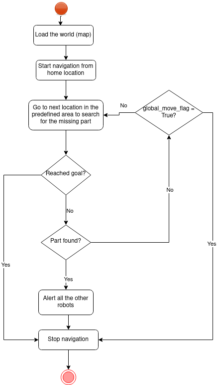

# Seeker Swarm
[](https://codecov.io/gh/vinay06vinay/SeekerSwarm)
[](LICENSE)
[](https://github.com/vinay06vinay/SeekerSwarm/actions/workflows/run-unit-test-and-upload-codecov.yml)

## Overview

Perception, Planning, and Controls are the three main components of any autonomous robotics system. Together, these parts enable the robot to see its surroundings, make judgments based on those perceptions, and carry out those decisions to accomplish the objective. In the ever-evolving landscape of warehouse management, the need for efficient and intelligent solutions has become paramount. In collaboration with Acme Robotics, we embark on a groundbreaking project to enhance their warehouse operations through the implementation of a multi-robot swarm system. This project aims to leverage the power of the Robot Operating System (ROS) to develop a sophisticated swarm of more than 20 TurtleBots capable of autonomously locating misplaced and valuable items within the warehouse. We plan to simulate the functionality in Gazebo and RViz before the deployment in the actual warehouse environment.

## Method

To implement the module to create a collaborative obstacle free environment for a group of swarm robots to avoid obstacles:
1. Firstly, all the turtlebots are deployed at different initial locations in the warehouse space. Once the bots are deployed, each turtlebot starts a search operation around some specified radius to look for the lost item.
2. Every turtlebot scans the Aruco marker present on the lost item which is unique for each good in the warehouse/ utilizes the camera to scan for the item using opencv.
3. While each turtlebot starts exploring, SLAM is utilized to localize it and avoid dynamic obstacles such as other turtlebots. It can also be used to generate both local and global maps of the environment for better optimization which is an ambitious goal for the project. 
4. If any of the turtlebots find the lost item, its coordinates are reported to the operator and other turtlebots. All the turtlebots move back to their original stations.

## Potential Risks
- **Dynamic Obstacle Avoidance**: As this is a multi robot environment each robot has to generate a path or search avoiding dynamic obstacles which could mainly be humans or other robots. To mitigate this we plan to study different planning algorithms available with the navigation package and choose the efficient one. Also, we would like to improve the robots localization through efficient SLAM implementation


## Activity Diagram

<p align="center">

</p>

## Team 

1. Neha Nitin Madhekar - Master of Engineering in Robotics - [Github](https://github.com/NehaMadhekar09)
2. Rashmi Kapu - Master of Engineering in Robotics - [Github](https://github.com/Rashmikapu)
3. Vinay Krishna Bukka - Master of Engineering in Robotics - [Github](https://github.com/vinay06vinay)

## Phase 0:
In phase 0 we have started with high level design and made a detailed proposal on the goals to be achieved according to the requirements of Acme Robotics.  

## Phase 1:

The details regarding the phase 1 process and implementation are clearly explained through a video which can be accessed through this [link](https://drive.google.com/drive/folders/1owMT9tn0x96qVgPtxg-muGZPfwGxZB40?usp=sharing)
- The proposal document and Quad Chart can be found [here](/proposal_documents)
- The Initial UML Diagrams are found [here](/UML/Phase1/uml_initial.pdf)

#### Software Practices: 
The phase is implemented using Agile Iterative Process with a 2 week sprint and also following pair programming. Please find the links below for detailed tasks:
1. [AIP Sheet](https://docs.google.com/spreadsheets/d/1NuIYBbttIKkYBfBp62UK6V-b4JHCreupMbSnzMCKfyM/edit?usp=sharing)
2. [Sprint Meeting Notes](https://docs.google.com/document/d/1hmF4FdUW7u_yZcx7FMOXFj-bEJ_aklQrRSQUA3DLxTc/edit?usp=sharing)

## Phase 2:

The Phase 2 consisted of implementation of all classes and making the swarm robots work. The details regarding the phase 2 process and implementation are clearly explained through a video which can be accessed through this [link](https://drive.google.com/drive/folders/1owMT9tn0x96qVgPtxg-muGZPfwGxZB40?usp=sharing)
- The Revised UML Diagrams are found [here](/UML/Phase2/UML_Final.pdf)

#### Software Practices: 
The phase is implemented using Agile Iterative Process with a 3 week sprint and also following pair programming. Please find the links below for detailed tasks:
1. [AIP Sheet](https://docs.google.com/spreadsheets/d/1NuIYBbttIKkYBfBp62UK6V-b4JHCreupMbSnzMCKfyM/edit?usp=sharing)
2. [Sprint Meeting Notes](https://docs.google.com/document/d/1hmF4FdUW7u_yZcx7FMOXFj-bEJ_aklQrRSQUA3DLxTc/edit?usp=sharing)


## Deliverables
- Project: Seeker Swarm
- Ros2 Package and build procedure required
- Overview of prosposed work, including timeline, results
- UML and class activity diagrams
- Code Coverage using CodeCov
- Detailed Doxygen Documentation
- Cpplint and Cppcheck error optimisation

## Code Build Procedure
Follow the below procedure to download the code and start building
```bash
# Source to ros humble
source /opt/ros/humble/setup.bash
# Go to the source directory of your ros2 workspace
cd ~/ros2_ws/src
git clone https://github.com/vinay06vinay/SeekerSwarm.git
# Go to the directory where the folder is downloaded
cd SeekerSwarm
# Once files are checked, go back to the root directory of ros workspace
cd ..
# Install rosdep dependencies before building the package
rosdep install -i --from-path src --rosdistro humble -y
# Build the package using colcon build
colcon build --packages-select SeekerSwarm
# After successfull build source the package
. install/setup.bash
```
## Execution of the Launch File and Node
```bash
# Terminal 1: Run below launch file which spawns 10 turtlebots in the environment
ros2 launch seeker_swarm launch.py
# Terminal 2 : Run below node for each robot spawned to start searching for the object
ros2 run seeker_swarm main_f
```

## Results: 
The swarm robots are successfully able to find the object through obstacle avoidance for each robot in warehouse. The result can be observed below:


## Method to Run Unit Tests
```bash
# How to build for tests (unit test and integration test)
  rm -rf build/ install/
  colcon build --cmake-args -DCOVERAGE=1 
# How to run tests (unit and integration)
  source install/setup.bash
  colcon test
```

## Method to Generate Coverage Reports
``` bash
ros2 run SeekerSwarm generate_coverage_report.bash
#Find the coverage report in ./build/seeker_swarm/test_coverage/index.html
```
### CppCheck & CppLint
```bash
# Use the below command for cpp check by moving to directory Seeker_Swarm
cppcheck --enable=all --std=c++17 --suppress=missingIncludeSystem $( find . -name *.cpp | grep -vE -e "^(./build/|./install/|./log/)" ) --check-config  &> results/cppcheck.txt

# Use the below command for cpp lint by moving to directory Seeker_Swarm 
cpplint  --filter=-build/c++11,+build/c++17,-build/namespaces,-build/include_order $( find . -name *.cpp | grep -vE -e "^(./build/|./install/|./log/)" ) &> results/cpplint.txt 

## The results of both are present in results folder insider Seeker_Swarm directory
```

## LICENSE

This project is open source and is released under the Apache License 2.0. You are free to use, modify, and distribute the code in accordance with the terms of the Apache License 2.0.

